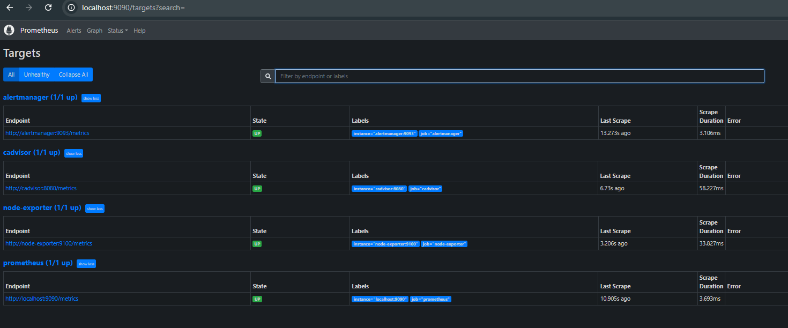
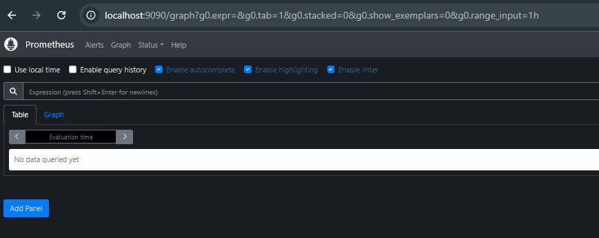
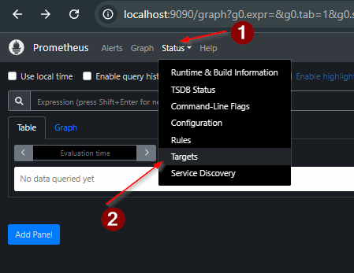

# Етап 1 — Prometheus (Docker Compose)

Ціль етапу: підняти Prometheus локально в Docker Compose, підключити базові таргети (self-scrape + експортери), переконатися що таргети `UP`, і закласти основу під алерти.

## Що зроблено на 1 етапі і навіщо

### 1) Docker Compose
Файл: `docker-compose.yml`

Додано/налаштовано сервіс `prometheus` (і мінімальні залежності, які йому потрібні вже на старті):
- **Prometheus** (`prom/prometheus:v2.36.2`) — збирає метрики та буде рахувати алерти.
- **node-exporter** — системні метрики (CPU/RAM/Disk/Network) для Linux/WSL2.
- **cAdvisor** — метрики по контейнерах Docker.
- **Alertmanager** — приймає алерти від Prometheus (на цьому етапі лише як endpoint).

Також додані:
- `prometheus_data` — volume для збереження TSDB Prometheus.
- `back-tier` — мережа для внутрішнього зв’язку сервісів.

Ключові налаштування Prometheus у compose:
- Монтування конфігів read-only: `./prometheus/ -> /etc/prometheus/:ro`.
- Зберігання даних: `prometheus_data -> /prometheus`.
- Увімкнено hot-reload конфіга: `--web.enable-lifecycle`.

> Примітка для Windows/Docker Desktop: для `node-exporter` прибрано mount propagation `rslave`, бо воно не підтримується і викликає помилку "not a shared or slave mount".

### 2) Конфіг Prometheus
Файл: `prometheus/prometheus.yml`

Налаштовано:
- `scrape_interval: 15s` — частота збору.
- `alerting.alertmanagers` — куди Prometheus надсилатиме алерти: `alertmanager:9093`.
- `scrape_configs` для таргетів:
  - `prometheus` → `localhost:9090`
  - `node-exporter` → `node-exporter:9100`
  - `cadvisor` → `cadvisor:8080`
  - `alertmanager` → `alertmanager:9093`

### 3) Заглушка для правил алертів
Файл: `prometheus/alert_rules.yml`

На 1 етапі файл створений як валідна заглушка, щоб Prometheus стартував без помилок. Далі (на етапі алертів) він буде заповнений правилами.

## Як запустити і перевірити

1) Підняти Prometheus (він підтягне залежності):
```bash
docker compose up -d prometheus
```

2) Відкрити Prometheus UI:
- http://localhost:9090

3) Перевірити Targets:
- `Status -> Targets`
- Очікувано: `prometheus`, `node-exporter`, `cadvisor`, `alertmanager` зі статусом `UP`.

4) Швидкі запити для перевірки:
- `up`
- `node_cpu_seconds_total`
- `container_cpu_usage_seconds_total`

## Скріншоти (screens)

### Контейнери підняті


### Prometheus UI


### Status -> Targets


## Джерело прикладу docker-compose
В основі взятий приклад зі спільноти:
- https://github.com/vegasbrianc/prometheus/blob/master/docker-compose.yml
