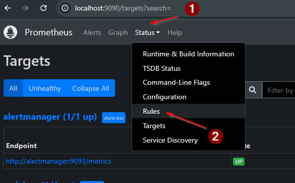
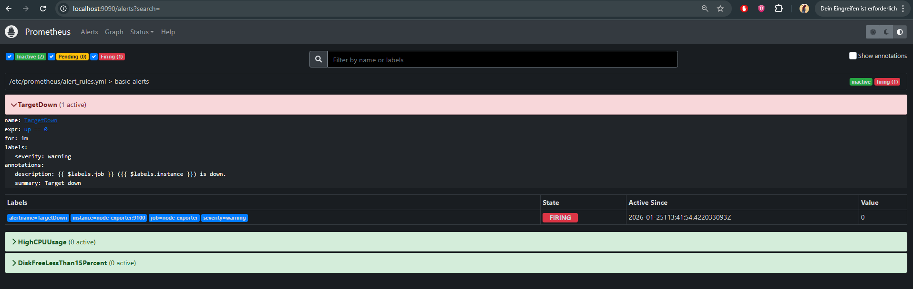
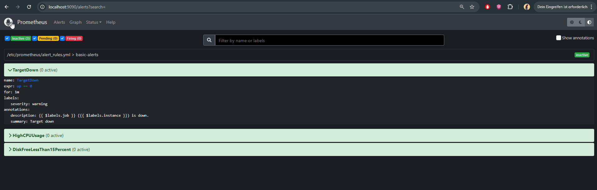
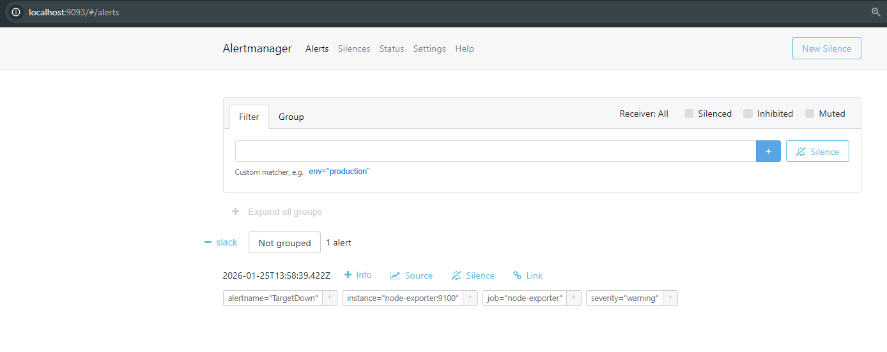

# Етап 2 — Alert rules у Prometheus (без Telegram)

Ціль етапу: додати 3 правила алертів у Prometheus, переконатися що вони завантажились і відображаються в UI (`Status -> Rules`, `Alerts`).

## Що зроблено

Файл правил: `prometheus/alert_rules.yml`

Додано групу `basic-alerts` і 3 алерти:

1) **TargetDown**
- Умова: `up == 0`
- Сенс: Prometheus не може зібрати метрики хоча б з одного таргету.

2) **HighCPUUsage**
- Умова: CPU usage > 80% (обчислюється як `100 - idle%`).
- Бере метрики з `node-exporter` (`node_cpu_seconds_total`).

3) **DiskFreeLessThan15Percent**
- Умова: вільний простір < 15%.
- Бере метрики з `node-exporter` (`node_filesystem_avail_bytes`, `node_filesystem_size_bytes`).

## Як перевірити

1) Переконатися, що таргети UP:
- http://localhost:9090/targets

2) Після зміни файлу правил зробити reload (будь-який варіант):
```bash
curl -X POST http://localhost:9090/-/reload
```
або
```bash
docker compose restart prometheus
```

3) Перевірити, що правила завантажились:
- `Status -> Rules` (або напряму http://localhost:9090/rules) — має бути група `basic-alerts`.
- `Alerts` — правила спочатку можуть бути `Inactive` (це нормально).

## Тест спрацювання (TargetDown)

Щоб продемонструвати, що алерт реально переходить у `FIRING`:

1) Зупинити `node-exporter`:
```bash
docker compose stop node-exporter
```

2) Почекати ~1–2 хвилини (бо в правилі `for: 1m`).

3) Відкрити `Alerts`:
- http://localhost:9090/alerts

4) Повернути `node-exporter`:
```bash
docker compose start node-exporter
```

Після старту `node-exporter` алерт має повернутися з `FIRING` у `Inactive` (після наступних scrape/evaluation циклів).

## Перевірка доставки в Alertmanager

Prometheus надсилає алерти в Alertmanager (налаштовано в `prometheus/prometheus.yml` через `alerting.alertmanagers`).

Під час тесту `TargetDown` перевірити Alertmanager UI:
- http://localhost:9093/#/alerts

Очікувано: алерт `TargetDown` відображається в Alertmanager, поки він активний.

## Скріншоти (screens)

### Status -> Targets


### Status -> Rules (basic-alerts)


### Alerts: TargetDown FIRING


### Alerts: після старту node-exporter (resolved)


### Alertmanager: TargetDown отримано

