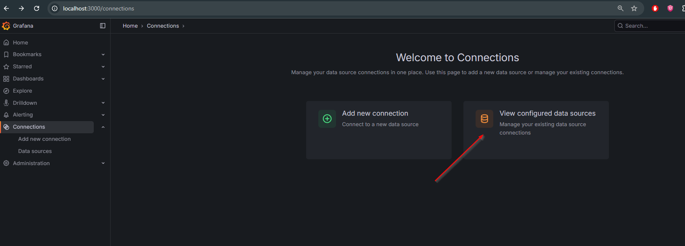
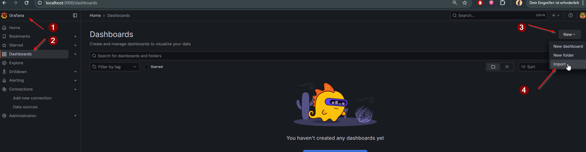
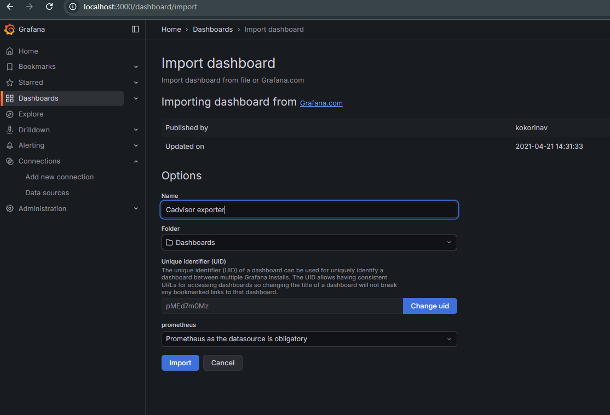
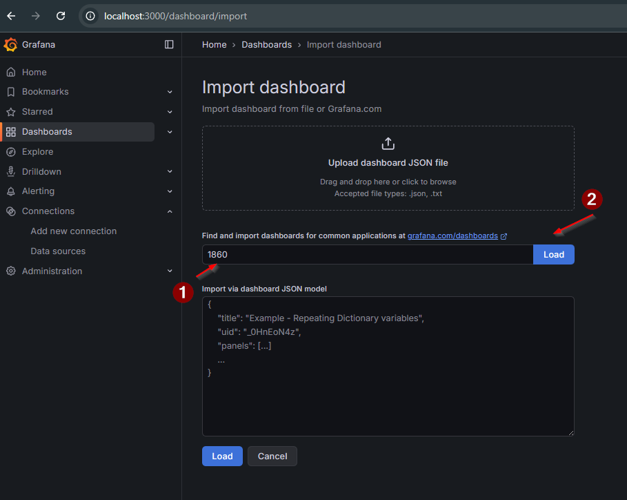
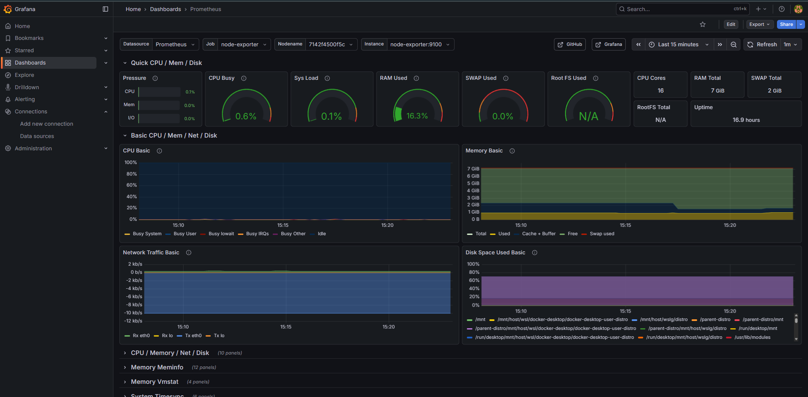
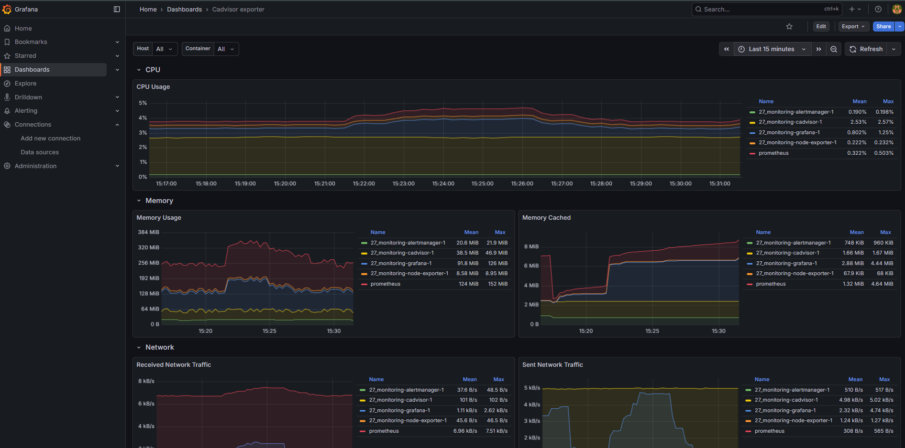
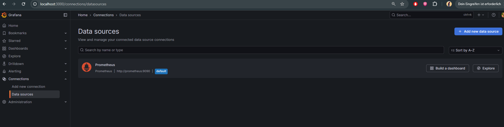

# Етап 3 — Grafana: Data Source + Dashboards

Ціль етапу: підняти Grafana, підключити Prometheus як data source, імпортувати готові dashboards зі спільноти Grafana для `node-exporter` та `cAdvisor`.

## Запуск Grafana

```bash
docker compose up -d grafana
```

Grafana UI:
- http://localhost:3000

Облікові дані (за замовчуванням у цьому репозиторії):
- login: `admin`
- password: `admin`

## Data Source: Prometheus (provisioning)

Файл: `grafana/provisioning/datasources/datasource.yml`

Grafana має автоматично підхопити Prometheus datasource через provisioning. Якщо datasource не з’явився — перезапусти Grafana:
```bash
docker compose restart grafana
```

Перевірка в UI:
- Connections → Data sources → Prometheus (має бути "Connected")

## Імпорт community dashboards

### 1) Node Exporter Full
- Dashboard URL: https://grafana.com/grafana/dashboards/1860-node-exporter-full/
- Dashboard ID: `1860`

Імпорт:
- Dashboards → New → Import → вставити ID `1860` → Load → вибрати datasource `Prometheus` → Import

### 2) cAdvisor Exporter
- Dashboard URL: https://grafana.com/grafana/dashboards/14282-cadvisor-exporter/
- Dashboard ID: `14282`

Імпорт:
- Dashboards → New → Import → вставити ID `14282` → Load → вибрати datasource `Prometheus` → Import

## Скріншоти (screens)

Нижче додані всі наявні скріншоти, що стосуються Grafana.

### Connections (екран підключень)


### Data source Prometheus (Save & Test)


### Імпорт dashboard (загальний екран)


### Імпорт dashboard: cAdvisor (ID 14282)


### Import dashboard: Node Exporter (ID 1860) — Load


### Dashboard: Node Exporter (створено)


### Dashboard: cAdvisor (створено)


### Result: Connections (дубль)


## Troubleshooting: Memory Usage “виросло і не падає”

Це зазвичай **нормально** після навантаження:

- Linux активно використовує **page cache** (кеш файлової системи) і не поспішає його звільняти.
- Багато Grafana панелей з cAdvisor показують `container_memory_usage_bytes`, а цей показник **включає cache**.

Щоб на дашборді бачити “реальне” споживання процесами (яке частіше падає після зупинки навантаження), зміни метрику на **working set**:

1) Відкрий панель **Memory Usage** → Edit.
2) У запиті PromQL заміни `container_memory_usage_bytes` на `container_memory_working_set_bytes`.
3) Збережи дашборд.

Альтернатива (якщо в панелі є доступні метрики cache):

- `container_memory_usage_bytes - container_memory_cache`

Також перевір, що time range у Grafana не стоїть на “Last 1h/6h”: якщо ти дивишся широкий діапазон, графік може виглядати так, ніби “не падає”, хоча на останніх хвилинах вже стабілізувався.

## Чекліст (готовність етапу)

- Grafana доступна на http://localhost:3000
- Data source `Prometheus` показує успішний `Save & test`
- Імпортовані dashboards `1860` (Node Exporter Full) та `14282` (cAdvisor Exporter)
