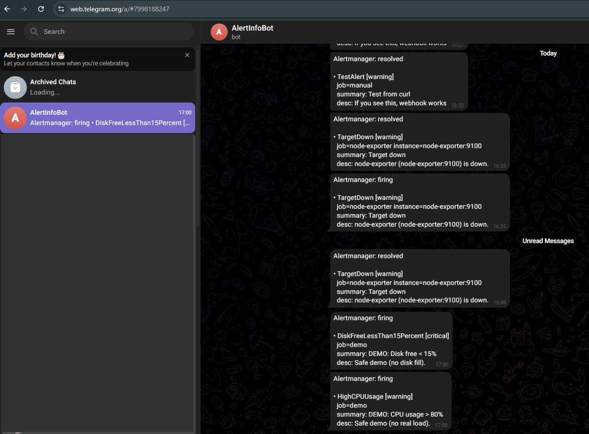
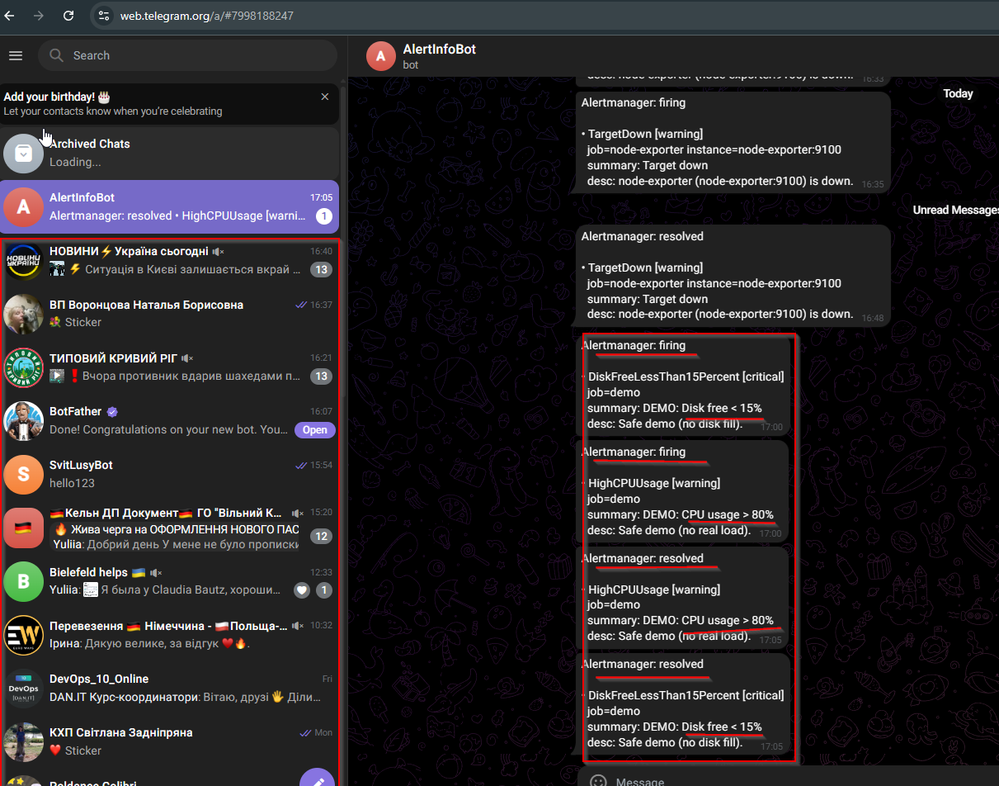

# Етап 4 — Telegram нотифікації (Alertmanager → Webhook → Telegram)

Ціль етапу: налаштувати доставку алертів у Telegram, коли Prometheus/Alertmanager генерує події (TargetDown / CPU / Disk).

## Як це працює

- Prometheus рахує alert rules (`prometheus/alert_rules.yml`).
- Prometheus відправляє алерти в Alertmanager (`prometheus/prometheus.yml` → `alerting.alertmanagers`).
- Alertmanager маршрутизує алерти на receiver `telegram`.
- Receiver `telegram` надсилає webhook на сервіс `telegram-webhook`.
- `telegram-webhook` формує повідомлення і шле його в Telegram Bot API.

## Що додано в репозиторій

- `telegram-webhook/` — мінімальний webhook-сервіс (FastAPI) для прийому Alertmanager webhook і відправки в Telegram.
- `telegram-webhook/.env.example` — приклад змінних оточення (token/chat id).
- `alertmanager/config.yml` — receiver `telegram` з `webhook_configs`.
- `docker-compose.yml` — сервіс `telegram-webhook`.

## Налаштування Telegram

1) Створи бота через `@BotFather` і отримай `TELEGRAM_BOT_TOKEN`.

2) Дізнайся `TELEGRAM_CHAT_ID`:

Найпростіший варіант через Telegram Bot API:

- Напиши боту будь-яке повідомлення (наприклад `/start`). Це важливо: поки ти не писала в чат — `getUpdates` може бути порожнім.
- Відкрий у браузері:
	- `https://api.telegram.org/bot<TELEGRAM_BOT_TOKEN>/getUpdates`
- Знайди `message.chat.id` — це і є `TELEGRAM_CHAT_ID`.

Примітка про групи: якщо бот має писати в групу — додай бота в групу, напиши повідомлення в групі, і в `getUpdates` буде `chat.id` (зазвичай від’ємне число).

3) Створи файл `telegram-webhook/.env` (НЕ коміть!) на основі `telegram-webhook/.env.example`:
```env
TELEGRAM_BOT_TOKEN=...
TELEGRAM_CHAT_ID=...
```

## Запуск

1) Перезапусти/підніми сервіси:
```bash
docker compose up -d --build alertmanager telegram-webhook
```

2) Перевір health webhook (опційно):
- http://localhost:8080/healthz (не публікуємо порт назовні за замовчуванням, тому цей пункт можна пропустити)

## Перевірка (рекомендовано: TargetDown)

1) Зупини `node-exporter`:
```bash
docker compose stop node-exporter
```

2) Почекай ~1–2 хв (бо в `TargetDown` стоїть `for: 1m`).

3) Перевір:
- Prometheus Alerts: http://localhost:9090/alerts (має бути `TargetDown` = FIRING)
- Alertmanager Alerts: http://localhost:9093/#/alerts
- Telegram: має прийти повідомлення від бота.

4) Поверни `node-exporter`:
```bash
docker compose start node-exporter
```

## Перевірка умов з ДЗ: CPU > 80% та Disk < 15%

Є 2 способи перевірки:

### Варіант A (безпечний для ПК): “демо-алерти” через Alertmanager API

Цей варіант **не створює реального навантаження** і не заповнює диск. Він потрібен, щоб швидко отримати скрін з Telegram з потрібними назвами алертів (`HighCPUUsage`, `DiskFreeLessThan15Percent`).

1) Відправ “CPU > 80%” демо-алерт (FIRING):
```bash
curl -X POST http://localhost:9093/api/v2/alerts \
	-H "Content-Type: application/json" \
	-d '[{"labels":{"alertname":"HighCPUUsage","severity":"warning","job":"demo"},"annotations":{"summary":"DEMO: CPU usage > 80%","description":"Безпечний демо-алерт (без реального навантаження)."},"startsAt":"2026-01-25T00:00:00Z"}]'
```

2) Відправ “Disk < 15%” демо-алерт (FIRING):
```bash
curl -X POST http://localhost:9093/api/v2/alerts \
	-H "Content-Type: application/json" \
	-d '[{"labels":{"alertname":"DiskFreeLessThan15Percent","severity":"critical","job":"demo"},"annotations":{"summary":"DEMO: Disk free < 15%","description":"Безпечний демо-алерт (без заповнення диска)."},"startsAt":"2026-01-25T00:00:00Z"}]'
```

3) Зроби скріни:
- Alertmanager UI: http://localhost:9093/#/alerts
- Telegram (повідомлення від бота)

4) (Опційно) Відправ “RESOLVED” для обох демо-алертів (закрити сповіщення):
```bash
curl -X POST http://localhost:9093/api/v2/alerts \
	-H "Content-Type: application/json" \
	-d '[
		{"labels":{"alertname":"HighCPUUsage","severity":"warning","job":"demo"},"annotations":{"summary":"DEMO: CPU usage > 80%"},"startsAt":"2026-01-25T00:00:00Z","endsAt":"2026-01-25T00:10:00Z"},
		{"labels":{"alertname":"DiskFreeLessThan15Percent","severity":"critical","job":"demo"},"annotations":{"summary":"DEMO: Disk free < 15%"},"startsAt":"2026-01-25T00:00:00Z","endsAt":"2026-01-25T00:10:00Z"}
	]'
```

### Варіант B (реальні умови)

Реально “дотиснути” диск до <15% на Docker Desktop (Windows) часто незручно/ризиковано (може зайняти десятки/сотні GB). Якщо викладач/перевірка вимагає саме реальні умови — краще робити це на окремій VM з маленьким диском.

## Що треба для здачі

- Код: `alertmanager/config.yml`, `telegram-webhook/*`, `docker-compose.yml`
- Скріни: Prometheus Alerts / Alertmanager Alerts / Telegram message

## Скріншоти (screens)

### Telegram: CPU + Disk alerts


### Telegram: resolved (send_resolved=true)

